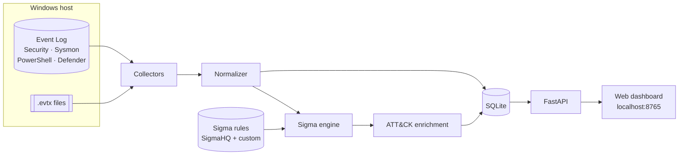

<div align="center">

# 👁️ TinyBrother

**Big Brother is watching everyone. TinyBrother only watches your own machine.**

A lightweight, local-first personal SOC for Windows: it collects Windows event logs,
runs **Sigma** detection rules against them, maps every alert to **MITRE ATT&CK**,
and shows everything in a local web dashboard. No cloud, no Elastic stack, no 12 GB of RAM.


</div>

---

## Why TinyBrother?

Enterprise SOC stacks (Wazuh, Security Onion, ELK) are powerful but heavy, and they hide how
detection actually works. TinyBrother is the opposite: small enough to run every day on a
laptop, and simple enough to read end to end. It is built as a learning and research
platform to answer a concrete question: **how much of a real attack can a single host detect
with open detection rules?**

## Features

| Status | Feature |
|:---:|---|
| 🚧 | Real-time collection from Windows Event Log (Security, Sysmon, PowerShell, Defender) |
| 🚧 | Offline analysis of `.evtx` files (forensics / replay mode) |
| 🚧 | Event normalisation to a common schema (ECS-inspired) |
| 🚧 | Sigma rule engine (SigmaHQ community rules + your own custom rules) |
| 🚧 | MITRE ATT&CK enrichment (tactic, technique, sub-technique) on every alert |
| 🚧 | SQLite storage for events and alerts |
| 🚧 | Local dashboard: alert timeline, severity breakdown, ATT&CK coverage heatmap |
| 📋 | Detection-coverage benchmark with Atomic Red Team |
| 📋 | IOC enrichment (hash reputation), anomaly detection, notifications |

🚧 in progress · 📋 planned · ✅ done

## Architecture



See [`docs/architecture.md`](docs/architecture.md) for the detailed design.

## Project layout

```
TinyBrother/
├── tinybrother/
│   ├── cli.py              # command-line entry point
│   ├── config.py           # configuration loading
│   ├── models.py           # Event / Alert data models
│   ├── collectors/         # Windows Event Log (live) and .evtx (offline) readers
│   ├── normalizer/         # raw Windows events -> common schema
│   ├── engine/             # Sigma rule loader and matcher
│   ├── attack/             # MITRE ATT&CK tag parsing and enrichment
│   ├── storage/            # SQLite persistence
│   └── dashboard/          # FastAPI app + static web UI
├── rules/
│   ├── sigma/              # SigmaHQ rules (downloaded, not committed)
│   └── custom/             # your own Sigma rules
├── config/                 # example configuration
├── scripts/                # Sysmon installer, Sigma rule fetcher
├── tests/                  # unit tests and sample events
└── docs/                   # architecture, roadmap, lab setup
```

## Quick start

> TinyBrother is in early development. The commands below describe the target usage.

**Requirements:** Windows 10/11, Python 3.10+, an **administrator** terminal (reading the
Security log requires it). Sysmon is strongly recommended.

```powershell
git clone https://github.com/<your-username>/TinyBrother.git
cd TinyBrother
python -m venv .venv
.venv\Scripts\activate
pip install -e ".[dev]"

# 1. (optional but recommended) install Sysmon with a community config
powershell -ExecutionPolicy Bypass -File scripts\install_sysmon.ps1

# 2. download the SigmaHQ Windows rules
python scripts\fetch_sigma_rules.py

# 3. copy and adjust the config
copy config\tinybrother.example.yaml config\tinybrother.yaml

# 4. watch your machine live
tinybrother watch

# ...or analyse an existing log file
tinybrother scan path\to\Security.evtx

# 5. open the dashboard
tinybrother dashboard        # -> http://127.0.0.1:8765
```

## Testing detections safely

TinyBrother is designed to be evaluated against **Atomic Red Team** simulations. Run those
tests **only inside a disposable Windows VM** (VirtualBox / VMware snapshot), never on your
main machine. The lab procedure lives in [`docs/lab-setup.md`](docs/lab-setup.md).

## Roadmap

See [`docs/roadmap.md`](docs/roadmap.md).

## Security & privacy

TinyBrother reads sensitive data (process command lines, logons, PowerShell script blocks).
Everything stays on your machine: the dashboard binds to `127.0.0.1` only and nothing is sent
to any external service unless you explicitly enable an enrichment module.

## Acknowledgements

- [SigmaHQ](https://github.com/SigmaHQ/sigma) for the open detection rule format and rules
- [MITRE ATT&CK®](https://attack.mitre.org/) for the adversary behaviour knowledge base
- [Sysinternals Sysmon](https://learn.microsoft.com/sysinternals/downloads/sysmon) and
  [SwiftOnSecurity sysmon-config](https://github.com/SwiftOnSecurity/sysmon-config)
- [Atomic Red Team](https://github.com/redcanaryco/atomic-red-team) for attack simulations

## License

MIT, see [LICENSE](LICENSE).
